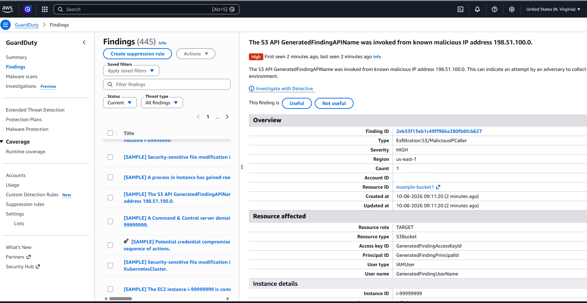
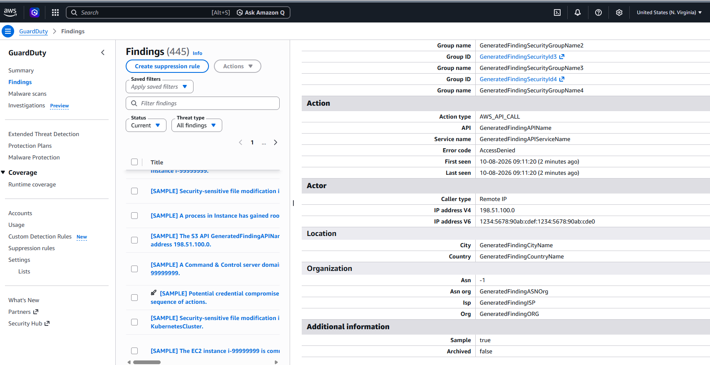

# AWS GuardDuty S3 Sample Finding Triage

**Project:** Secure AWS Environment & Monitoring Lab  
**Status:** Practice exercise completed  
**Type:** SIMULATED — GuardDuty-generated sample

## Objective
Practice interpreting a security finding without generating malicious activity or deploying unnecessary compute.

## Investigation
Reviewed a High-severity S3 sample finding, including the affected resource, identity, action, actor, and sample indicator. Identified placeholder values and an AccessDenied action outcome.

## Assessment
The request represented by the sample was denied. Neither the severity nor the finding category established successful data theft. No real attack activity was inferred from the fictional sample details.

## Skills demonstrated
Finding triage, action-outcome interpretation, separating simulated evidence from actual telemetry, and documenting uncertainty.

## Limitations
This did not test detection of a live attack or demonstrate containment. Sample findings cannot be correlated with real attack activity in the account. No EC2 instance was launched for this exercise.

## Evidence
These screenshots document a **SIMULATED GuardDuty sample**, not a live incident. Originals and notes remain in the private lab archive.

*High-severity sample finding with generated resource and identity placeholders. The account identifier is redacted.*

*The sample action reports AccessDenied and Sample: true. The displayed actor addresses are fictional sample values and are not real threat indicators.*

