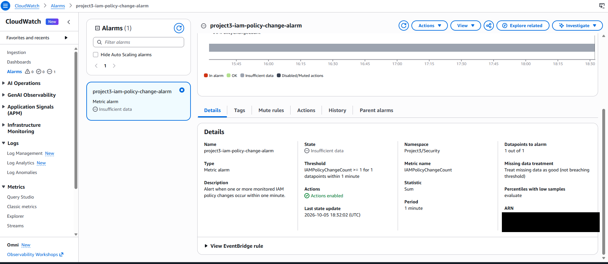
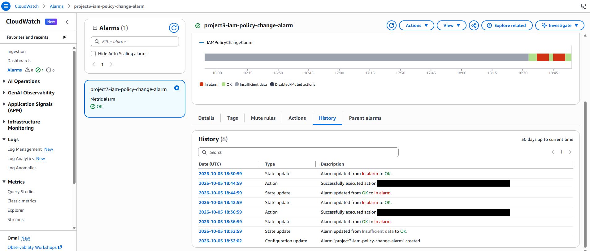

# AWS IAM Policy-Change Alerting

**Project:** Secure AWS Environment & Monitoring Lab  
**Status:** Exercise completed; broader project in progress  
**Type:** Controlled hands-on test

## Objective
Practice detecting an IAM policy change and validating an operator notification.

## Hands-on work
Reviewed AWS audit logging and configured event routing, log-based metrics, an alarm, and an email notification. Created a temporary, unattached test policy and removed it after validation.

## Validation and result
Observed the initial alarm transition, received the notification, and observed recovery to OK. The cleanup action produced a second alert. Reviewed the corresponding audit event to connect the action with the notification.

## Skills demonstrated
CloudTrail audit review, EventBridge event routing, CloudWatch Logs and alarms, SNS notifications, controlled testing, and cleanup.

## Limitations
This demonstrated change monitoring, not malicious-activity classification or least-privilege enforcement. The published alarm history confirms return to OK after the cleanup alert.

## Evidence
Selected screenshots are published below with account-bearing identifiers redacted using solid boxes. Originals and validation notes remain in the private lab archive.

*Alarm configuration: Sum threshold of at least 1 within a one-minute period; missing data treated as not breaching. The displayed state is the initial configuration state.*

*History records both alert cycles, successful SNS actions, and return to OK after cleanup.*

