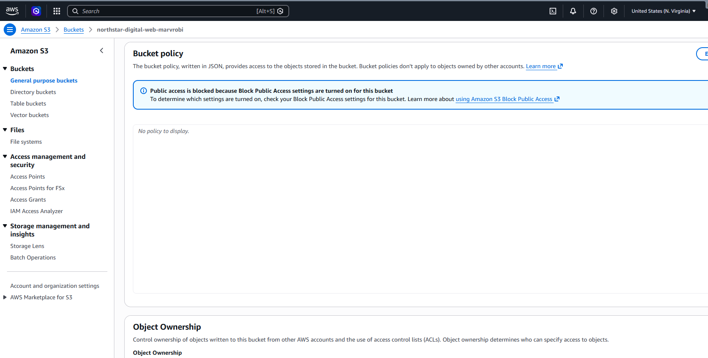
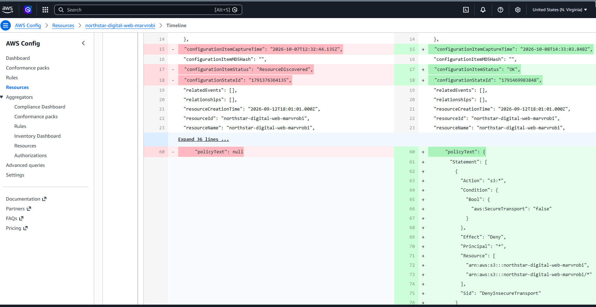
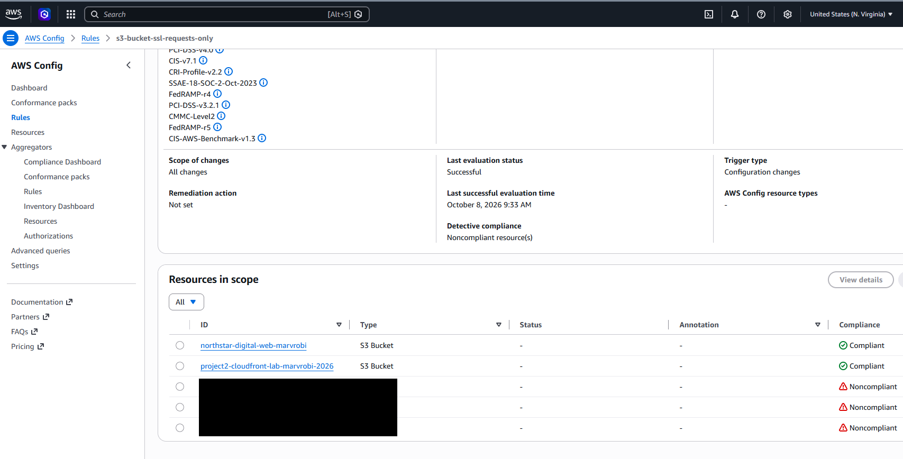

# AWS S3 HTTPS Enforcement

**Projects:** Cloud Portfolio Website and Secure AWS Environment & Monitoring Lab  
**Status:** Selected-bucket remediation completed; broader monitoring project in progress  
**Type:** Real configuration remediation

## Objective
Investigate and fix an S3 encryption-in-transit compliance gap.

## Investigation
AWS Config flagged a lab bucket for lacking HTTPS enforcement. Compared its recorded configuration with the current S3 settings and checked that static website hosting was disabled before making the change.

## Remediation
Added a bucket-policy deny statement for insecure transport, covering the bucket and its objects. This did not grant access. A related private-origin exercise preserved its existing CloudFront access statement while adding HTTPS enforcement.

## Validation and result
Reviewed the policy-change request in CloudTrail. AWS Config captured the updated policy, showed the before-and-after difference, and marked the selected bucket compliant with the HTTPS-only rule.

## Skills demonstrated
S3 policy analysis, configuration history, audit correlation, remediation, and evidence-based validation.

## Lessons and limitations
Block Public Access, encryption at rest, and encryption in transit address different requirements. Passing this rule does not establish complete bucket security. No live HTTP-versus-HTTPS request test was performed. A related CloudFront availability check did not establish a fresh origin retrieval.

## Evidence
Selected screenshots are published below. Account-bearing resource identifiers are redacted using solid boxes; originals and audit evidence remain private.

*Before remediation: no bucket policy was present, while Block Public Access was enabled.*

*AWS Config captured the change from no policy to an explicit Deny when aws:SecureTransport is false, covering the bucket and its objects.*

*The selected bucket is Compliant with s3-bucket-ssl-requests-only. Other resources remain Noncompliant; this result applies only to this rule.*

