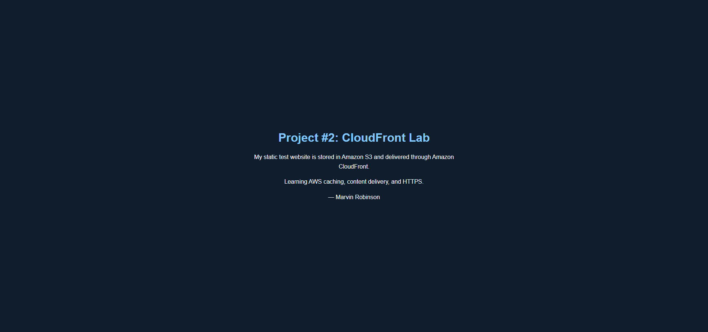
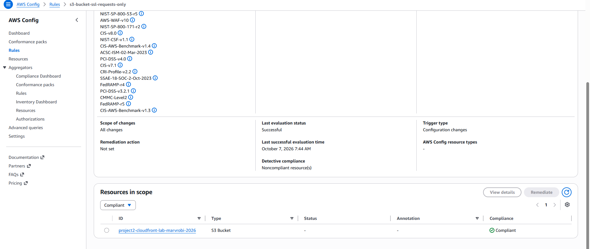

# AWS WordPress Recovery and Private S3 Delivery

**Project:** WordPress / Cloud Infrastructure Lab  
**Status:** Completed  
**Type:** Controlled recovery and security-controls exercise

## Objective
Validate manual recovery of a WordPress workload and practice secure static-content delivery.

## Hands-on work
Deployed WordPress on Lightsail, configured monitoring, created a baseline snapshot, and restored it to a temporary replacement instance. Reassigned the stable endpoint and verified application availability, then restored the original arrangement and removed the temporary instance.

In a separate static-content exercise, configured a private S3 origin with CloudFront, HTTPS delivery, and redirect behavior.

## Validation and result
Verified the recovered WordPress application through the stable endpoint. Verified HTTPS delivery and a CloudFront cache hit for the static-content path. Completed architecture and operational documentation.

## Skills demonstrated
Snapshot recovery, service validation, monitoring, private origin access, encrypted delivery, cleanup, and cost awareness.

## Limitations
This demonstrated manual recovery, not automatic multi-Availability-Zone failover or zero downtime. Recovery planning targets were not measured guarantees. A cache hit does not establish a fresh origin retrieval. The WordPress and static-content exercises were separate components.

## Evidence
Selected evidence from the separate static-content exercise is published below; originals and architecture notes remain private.

*Rendered Project #2 page. This image establishes visible page content; it does not independently prove HTTPS, a cache hit, or a fresh origin fetch.*

*The Project #2 S3 bucket is Compliant with s3-bucket-ssl-requests-only. This rule result does not establish complete bucket security or WordPress recovery.*

